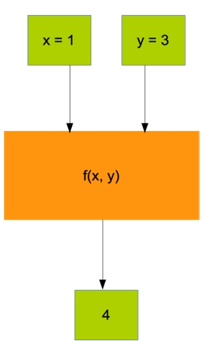
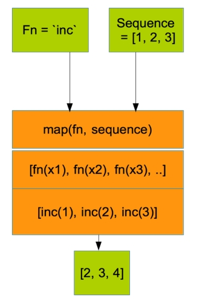

title: An introduction to functional programming
author:
  name: Martino Visintin
  email: mvisinti@thoughtworks.com

--
[www.lighttable.com](http://www.lighttable.com)

(if you want to follow along)
--
# Functional programming
## (in clojure)
--
## Why clojure
- it runs on the JVM:
  - fast
  - wealth of libraries
  - runs pretty much everywhere
- it's a lisp:
  - easy, consistent structure
  - mad metaprogramming (won't get into this)
- great community
- lighttable
--


Shoshin
--
## What is a function?

--
## The functional programming way
Simple data structures that "flow" through a pipeline of very general functions.
```
{                                                        {
  name: "lemon_tree"                                       name: "lemon_tree"
  no-of-fruit: 0                                           no-of-fruit: 10
  age: 3                 >>   water!  >>   age!   >>       age: 4
  type: :tree                                              type: :tree
}                                                        }
```
--
## Applying a fn
```clojure
(+ 1 1)   ; => 2

(even? 1) ; => false
(even? 2) ; => true

(inc 2)       ; => 3
(inc (+ 1 1)) ; => 3
```
- lots of parentheses (but don't let them scare you)
- prefix notation `(+ 1 1 1 1)`
- weird at first, but very simple and consistent
--
# DEMO #
--
## Defining a fn
An anonymous function:
```clojure
(fn [n] (* n n))
```
... And a named one:

```clojure
(defn square [n] (* n n))
```
--
# DEMO #
--
## Values
Values in fn programming are immutable:
```clojure
(let [bunny 3
      more-awesome-bunny (square bunny)]
      more-awesome-bunny)
```
--
# Fizz-Buzz
```clojure
(fizz-buzzify 1)  ; => 1
(fizz-buzzify 2)  ; => 2
(fizz-buzzify 3)  ; => "Fizz"
(fizz-buzzify 5)  ; => "Buzz"
(fizz-buzzify 15) ; => "FizzBuzz"
```
--
# DEMO #
--
# Common functional creatures
--
## Remember, a fn is just this:

--
## Map
```clojure
(map inc [1 2 3])
;; => [2 3 4]

(map square [1 2 4])
;; => [1 4 16]

(map (fn [n] (* n 100)) [1 2 4])
;; => [100 200 400]
```
--

--
## Apply (utility)
```clojure
;; (* [1 2 3 4])
;; => doesn't work. Cannot apply * to an array()

(apply + [1 2 3 4])
;; == (+ 1 2 3 4)
;; => 10

(apply * [1 2 3 4])
;; == (* 1 2 3 4)
;; => 24
```
--
## Filter
```clojure
(filter even? [1 2 3 4 5 6])
;; => [2 4 6]
```
```clojure
(filter
  even?          ;; <= a fn
  [1 2 3 4 5 6]) ;; <= a list
;; => [2 4 6]

(filter
  (fn [n] (= 1 n)) ;; <= a fn
  [1 2 4])         ;; <= a list
;; => [1]
```
--
# Currency Converter #
```clojure
(convert [10 :eur] :usd)
;; => [13.5 :usd]

(add-all [10 :eur] [13.5 :usd])
;; => [20.0 :eur]
```
--
```java
public class Euro implements Currency {
    private final double value;
    private static final double DOLLAR_EXCHANGE_RATE = 1.35;
    public Euro(double value) {
        this.value = value;
    }
    public boolean equals(Object other) {
        return other instanceof Currency && value == otherCurrencyToEuro((Currency) other);
    }
    public double getValue() {
        return value;
    }
    public double getValueInDollars() {
        return value * DOLLAR_EXCHANGE_RATE;
    }
    public Euro plus(Currency other) {
        double newValue = value + otherCurrencyToEuro(other);
        return new Euro(newValue);
    }
    private double otherCurrencyToEuro(Currency other) {
       return (other.getValueInDollars()/DOLLAR_EXCHANGE_RATE);
    }
}
// oh.. there's 3 more of these
// .. yuck.
```
--
# LIVE CODING #
--
## Upgrading your clojure-fu

- [clojure koans](http://github.com/functional-koans/clojure-koans)
- [4clojure.com](http://www.4clojure.com)
- [Clojure from the ground up](http://aphyr.com/tags/Clojure-from-the-ground-up)
- [Clojure for the brave and true](http://www.braveclojure.com)

- functional programming for the oo programmer [book]
- programming clojure [book]
- the joy of clojure [book]
- web development with clojure [book]

--
## Reduce
```clojure
(reduce + [1 2 3 4])
;; => 10

;; 1 + 2 = 3
;; 3 + 3 = 6
;; 6 + 4 = 10
;; => 10

(reduce * [1 2 3 4])
;; => 24
```
